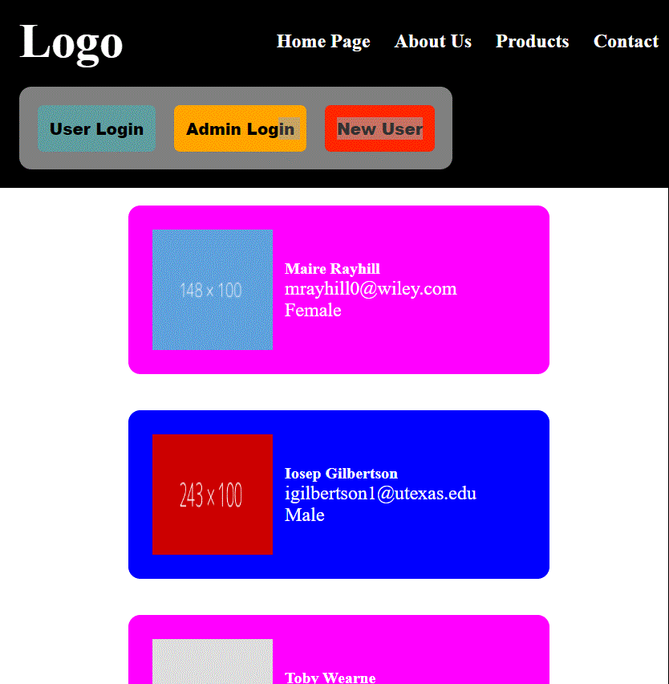

# Project Readme



## Overview

This project consists of a React application that displays a list of user cards, each containing information about an individual. Users can interact with the application by logging in as either a regular user or an admin. Additionally, there is a modal component for updating user information.

## Project Structure

The project is organized into several components:

- **App Component (`App.js`):**

  - The main component that renders the header and user cards.
  - Utilizes the `Header` and `Card` components.
  - Maintains state for the active user count.

- **Header Component (`Header.js`):**

  - Displays the website's logo, navigation menu, and login/logout functionality.
  - Uses the `Button` component for various buttons.
  - Conditionally renders an `InfoBox` component for active user information.
  - Triggers the display of a `Modal` component for new user creation.

- **Card Component (`Card.js`):**

  - Represents an individual user card.
  - Dynamically styles the card based on the user's gender.
  - Utilizes the `Modal` component for editing user information.

- **Modal Component (`Modal.js`):**

  - A modal for editing user information.
  - Displays input fields for first name and last name.
  - Utilizes the `Button` component for save and close actions.

- **InfoBox Component (`InfoBox.js`):**

  - Displays information boxes for the active user count.
  - Used in the `Header` component.

- **Button Component (`Button.js`):**
  - A reusable button component with customizable styling.

## Styling

- **CSS Files:**
  - Global styles are defined in `App.css`.
  - Component-specific styles are in their respective CSS files (`header.css`, `modal.css`, `card.css`, `customBtn.css`).

## Usage

1. Install dependencies:

   ```bash
   npm install
   ```
